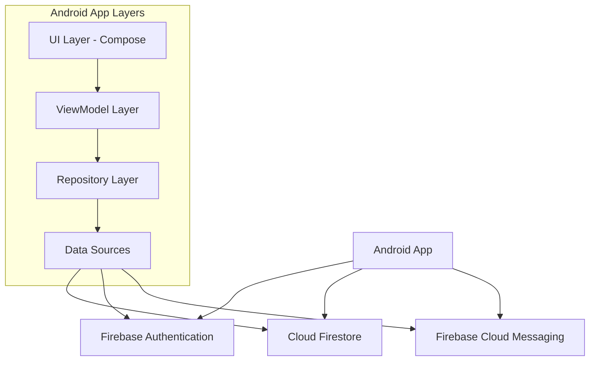
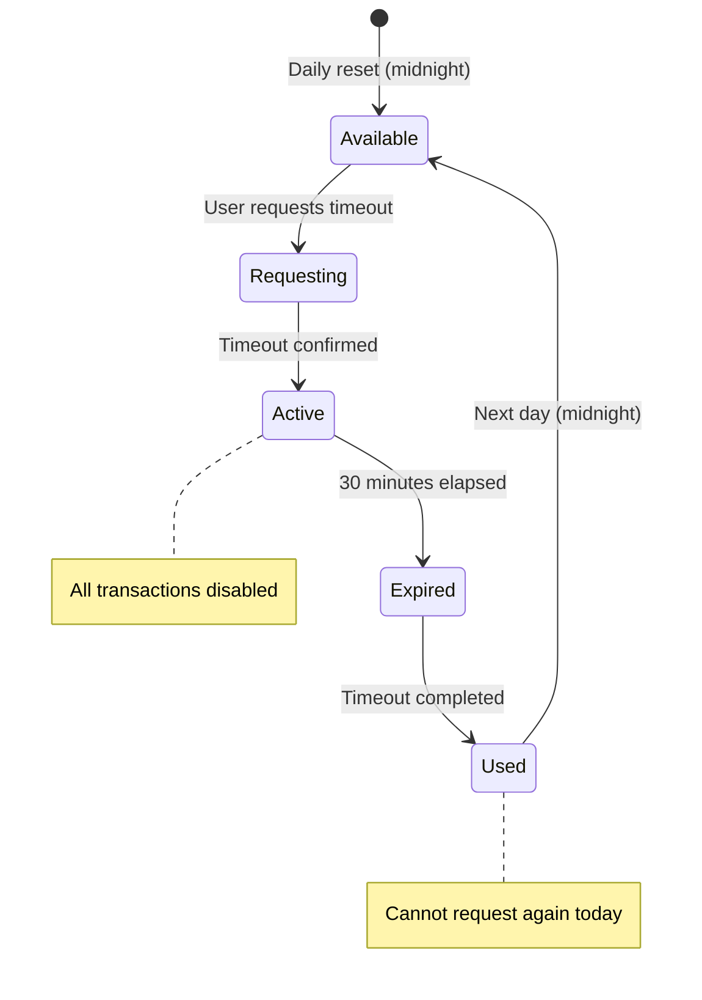
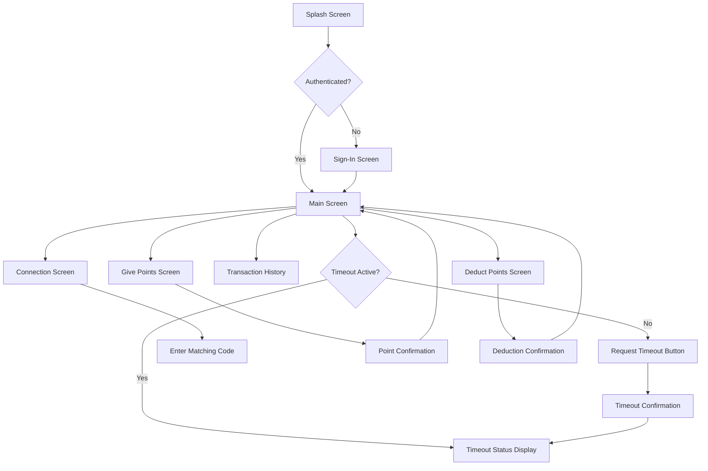

# Design Document

## Overview

The Brownie Points App is an Android application built using modern Android development practices with Firebase as the backend. The app follows MVVM architecture pattern with Repository pattern for data management, leveraging Firebase Authentication, Firestore, and Cloud Messaging for a seamless real-time experience.

### Key Technologies
- **Android SDK** with Kotlin
- **Jetpack Compose** for modern UI
- **Firebase Authentication** with Google Sign-In
- **Cloud Firestore** for real-time data storage
- **Firebase Cloud Messaging** for push notifications
- **MVVM Architecture** with Repository pattern
- **Coroutines** for asynchronous operations

## Architecture

### High-Level Architecture



### App Architecture Pattern

The app follows Clean Architecture principles with MVVM:

- **UI Layer**: Jetpack Compose screens and components
- **Presentation Layer**: ViewModels managing UI state
- **Domain Layer**: Use cases and business logic
- **Data Layer**: Repositories and data sources (Firebase)

## Components and Interfaces

### 1. Authentication System

**AuthRepository**
- Handles Google Sign-In integration
- Manages Firebase Authentication state
- Creates user profiles in Firestore on first sign-in

**AuthViewModel**
- Manages authentication UI state
- Handles sign-in/sign-out operations
- Observes authentication state changes

### 2. User Management

**User Data Model**
```kotlin
data class User(
    val uid: String,
    val displayName: String,
    val email: String,
    val photoUrl: String?,
    val matchingCode: String,
    val connectedUserId: String? = null,
    val totalPointsReceived: Int = 0,
    val createdAt: Timestamp
)
```

**UserRepository**
- CRUD operations for user profiles
- Generates unique matching codes
- Manages user connections

### 3. Connection System

**ConnectionRepository**
- Handles matching code validation
- Establishes connections between users
- Manages connection state in Firestore

**Connection Data Model**
```kotlin
data class Connection(
    val id: String,
    val user1Id: String,
    val user2Id: String,
    val createdAt: Timestamp,
    val isActive: Boolean = true
)
```

### 4. Points Transaction System

**Transaction Data Model**
```kotlin
data class Transaction(
    val id: String,
    val senderId: String,
    val receiverId: String,
    val points: Int, // Can be negative for deductions
    val message: String? = null,
    val timestamp: Timestamp,
    val connectionId: String,
    val type: TransactionType = TransactionType.GIVE
)

enum class TransactionType {
    GIVE,    // Positive points (giving brownie points)
    DEDUCT   // Negative points (deducting for conflicts)
}
```

**TransactionRepository**
- Creates point transactions with atomic operations (positive and negative)
- Validates point amounts: 1-10 for giving, -1 to -10 for deducting
- Queries transaction history with type filtering
- Updates user point balances (allows negative balances)
- Handles offline persistence for all transaction types

### 5. Timeout System for Conflict Resolution

**Timeout Data Model**
```kotlin
data class Timeout(
    val id: String,
    val userId: String,
    val connectionId: String,
    val startTime: Timestamp,
    val duration: Long = 30 * 60 * 1000, // 30 minutes in milliseconds
    val isActive: Boolean = true,
    val createdDate: String // YYYY-MM-DD format for daily tracking
)
```

**TimeoutRepository**
- Manages timeout creation and validation
- Tracks daily timeout usage per user
- Handles timeout expiration logic
- Synchronizes timeout state between partners
- Implements automatic cleanup of expired timeouts

**TimeoutManager**
- Validates daily timeout allowance (once per day per user)
- Manages 30-minute countdown timer
- Disables/enables transaction functionality based on timeout state
- Handles automatic timeout expiration
- Sends timeout-related notifications

### 6. Notification System

**NotificationRepository**
- Manages FCM token registration
- Sends push notifications for point transactions (give/deduct)
- Handles timeout-related notifications
- Manages in-app notification display for all event types

## Data Models

### Firestore Collections Structure

```
users/
├── {userId}/
    ├── uid: string
    ├── displayName: string
    ├── email: string
    ├── photoUrl: string
    ├── matchingCode: string
    ├── connectedUserId: string
    ├── totalPointsReceived: number (can be negative)
    ├── fcmToken: string
    ├── lastTimeoutDate: string (YYYY-MM-DD format)
    └── createdAt: timestamp

connections/
├── {connectionId}/
    ├── user1Id: string
    ├── user2Id: string
    ├── createdAt: timestamp
    ├── isActive: boolean
    └── currentTimeoutUserId: string (optional, tracks active timeout)

transactions/
├── {transactionId}/
    ├── senderId: string
    ├── receiverId: string
    ├── points: number (positive for give, negative for deduct)
    ├── message: string
    ├── timestamp: timestamp
    ├── connectionId: string
    └── type: string ("GIVE" or "DEDUCT")

timeouts/
├── {timeoutId}/
    ├── userId: string
    ├── connectionId: string
    ├── startTime: timestamp
    ├── endTime: timestamp
    ├── duration: number (milliseconds)
    ├── isActive: boolean
    └── createdDate: string (YYYY-MM-DD)
```

### Security Rules

Firestore security rules will ensure:
- Users can only read/write their own profile
- Users can only create transactions where they are the sender
- Users can only read transactions where they are sender or receiver
- Connection documents are readable by both connected users

## Error Handling

### Network Errors
- Implement retry mechanisms for failed operations
- Display user-friendly error messages
- Use Firestore offline persistence for seamless offline experience

### Authentication Errors
- Handle Google Sign-In failures gracefully
- Provide clear feedback for authentication issues
- Implement automatic token refresh

### Data Validation
- Validate point amounts (1-10 range)
- Validate message length (200 character limit)
- Validate matching code format

### Offline Handling
- Use Firestore offline persistence
- Queue operations when offline
- Sync automatically when connection restored
- Display offline status indicator

## Couple-Focused Features Design

### Point Deduction System

**Design Principles:**
- Clear visual distinction from positive point giving
- Confirmation dialogs to prevent accidental deductions
- Support for negative balances to reflect relationship conflicts
- Reason messages encouraged for better communication

**Implementation Details:**
- Reuse existing transaction infrastructure with negative point values
- Add TransactionType enum to distinguish give vs deduct operations
- Update UI components with red/warning themes for deductions
- Implement validation for deduction amounts (1-10 points)

**User Experience:**
- Separate "Deduct Points" button with warning styling
- Confirmation dialog explaining the action
- Optional but encouraged reason message
- Clear feedback showing updated (potentially negative) balance

### Daily Timeout System

**Design Principles:**
- Once per day limit to prevent abuse
- 30-minute duration for effective cool-down
- Mutual enforcement (affects both partners)
- Automatic expiration with notifications

**Implementation Details:**
- Track timeout usage by date (YYYY-MM-DD format)
- Use Firestore real-time listeners for instant synchronization
- Implement countdown timer with local and server-side validation
- Disable transaction UI during active timeouts

**User Experience:**
- Prominent "Request Timeout" button during conflicts
- Clear countdown display showing remaining time
- Disabled state for all point transactions during timeout
- Notifications for timeout start, end, and partner requests

**Timeout State Management:**


### Conflict Resolution Workflow

**Typical Usage Pattern:**
1. **Conflict Occurs**: Partners can deduct points with reasons
2. **Escalation**: Either partner can request timeout break
3. **Cool-down**: 30-minute period with disabled transactions
4. **Resolution**: Partners can give points to make amends
5. **Reset**: Daily timeout allowance resets at midnight

**Data Synchronization:**
- Real-time updates ensure both partners see timeout status immediately
- Transaction disabling is enforced on both devices
- Timeout expiration automatically re-enables functionality
- All state changes trigger appropriate notifications

## Testing Strategy

### Unit Tests
- Repository layer business logic
- ViewModel state management
- Data model validation
- Utility functions

### Integration Tests
- Firebase Authentication flow
- Firestore data operations
- End-to-end transaction flow

### UI Tests
- Screen navigation
- User input validation
- Notification display
- Offline behavior

### Firebase Testing
- Use Firebase Emulator Suite for local testing
- Test Firestore security rules
- Test Cloud Functions (if needed)
- Mock Firebase services for unit tests

## User Interface Design

### Screen Flow


### Key Screens

1. **Sign-In Screen**
   - Google Sign-In button
   - App branding and welcome message

2. **Main Screen**
   - Current point balance display (can show negative values)
   - Connected partner profile
   - Quick actions: Give Points, Deduct Points, View History
   - Timeout status indicator and Request Timeout button
   - Connection status indicator
   - Disabled state overlay when timeout is active

3. **Give Points Screen**
   - Point amount selector (1-10)
   - Optional message input
   - Partner profile display
   - Send button with confirmation
   - Disabled when timeout is active

4. **Deduct Points Screen**
   - Point amount selector (1-10 for deduction)
   - Required reason message input
   - Partner profile display
   - Clear visual indicators (red theme) for deduction
   - Deduct button with confirmation dialog
   - Disabled when timeout is active

5. **Transaction History Screen**
   - Chronological list of transactions
   - Visual distinction between give (green) and deduct (red) transactions
   - Filter options (sent/received, give/deduct)
   - Transaction details with messages and transaction type
   - Running balance calculation

6. **Connection Screen**
   - Display own matching code
   - Input field for partner's matching code
   - Connection status and partner info

7. **Timeout Management**
   - Timeout request confirmation dialog
   - Active timeout countdown display
   - Timeout status shared between partners
   - Timeout expiration notifications

### UI Components
- Custom point selector component (for both give and deduct)
- Transaction list item component with type indicators
- Connection status indicator
- Timeout status indicator and countdown timer
- Notification toast component for all event types
- Loading states and error displays
- Confirmation dialogs for deductions and timeouts
- Disabled state overlays during timeouts

## Performance Considerations

### Firestore Optimization
- Use compound indexes for complex queries
- Implement pagination for transaction history
- Cache frequently accessed data
- Use Firestore offline persistence

### Memory Management
- Properly dispose of Firestore listeners
- Use lifecycle-aware components
- Implement proper image caching for profile photos

### Battery Optimization
- Minimize background processing
- Use efficient notification handling
- Implement proper listener lifecycle management

## Security Considerations

### Data Privacy
- Store minimal user data
- Implement proper data encryption
- Follow GDPR compliance guidelines
- Provide data deletion options

### Authentication Security
- Use Firebase Authentication best practices
- Implement proper token validation
- Handle authentication state securely
- Protect against unauthorized access

### Firestore Security
- Implement comprehensive security rules
- Validate all client-side operations server-side
- Prevent data tampering
- Audit data access patterns